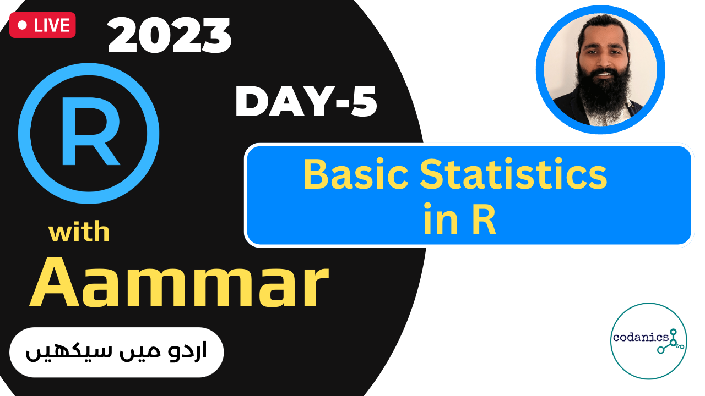

# **R with Aammar: R for Data Analysis**
**Learn R programming in Urdu/Hindi Language with desi examples and hands-on training**

Table of Content:
- [**R with Aammar: R for Data Analysis**](#r-with-aammar-r-for-data-analysis)
  - [**What is R?**](#what-is-r)
  - [**Resources to be used in this course**](#resources-to-be-used-in-this-course)
    - [*Software*](#software)
    - [*Books*](#books)
  - [**Lectures on R with Aammar (in Urdu/Hindi)**](#lectures-on-r-with-aammar-in-urduhindi)
    - [**Lecture 1a: Installation of Software and Introduction to R**](#lecture-1a-installation-of-software-and-introduction-to-r)
    - [**Lecture 1b: First Line of Code in R and learning to work with R**](#lecture-1b-first-line-of-code-in-r-and-learning-to-work-with-r)
    - [**Lecture 2: Data Visualization and plotting in R using ggplot2**](#lecture-2-data-visualization-and-plotting-in-r-using-ggplot2)
    - [**Lecture 3: Data Visualization and Data Transformation in R using tidyverse packages**](#lecture-3-data-visualization-and-data-transformation-in-r-using-tidyverse-packages)
    - [**Publication Ready Graphs in R**](#publication-ready-graphs-in-r)
    - [**Lecture 4: Data Transformation in R using tidyverse packages**](#lecture-4-data-transformation-in-r-using-tidyverse-packages)
    - [**Lecture 5: Statistics in R**](#lecture-5-statistics-in-r)
    - [**Lecture 6: Choosing a right Statistical Method for Data Analysis in R**](#lecture-6-choosing-a-right-statistical-method-for-data-analysis-in-r)

## **What is R?**

A competent data scientist is a passionate coder-statistician, and there is no better programming language to master than R. R is known as the `golden child` of data science since it is the industry standard for statistical programming languages. It's a prominent ability among Big Data analysts, and R-skilled data scientists are in high demand from companies like Google, and Facebook. R is also very popular among researchers due to it's steep learning curve and high quality data visualization graphics for publication. 

> Top 9 points why to learn about R:
> 1. R is Open source and freely available
> 2. R is cross platform compatible
> 3. R is very powerful in handling big datasets
> 4. R is one of the top programming language having more than 2.5 million users
> 5. R is highly flexible and Evolving
> 6. Book or Manuscript publishers love R
> 7. Professors prefer students having R skills over the one who don't know R
> 8. R has a vibrant community and resources (Books, tutorials, blogs etc.)
> 9. Much more......

## **Resources to be used in this course**
### *Software* 
1. [R](https://cran.r-project.org) - Download R programming software here
2. [RStudio](https://rstudio.com/products/rstudio/download/#download) - RStudio is an integrated development environment (IDE) for R. It includes a console, syntax-highlighting editor that supports direct code execution, as well as tools for plotting, history, debugging and workspace management.

### *Books*
1. [R for Data Science- 1st Edition](https://r4ds.had.co.nz) - This book is a practical introduction to data science with R. It is designed for people who are familiar with R, but who want to learn more about data science. It is also designed for people who are familiar with data science, but who want to learn R.
2. [R for Data Science- 2nd Edition](http://r4ds.hadley.nz/) -  THis book has updated knowledge base for R.
3. [R Cookbook - 2nd Edition](https://rc2e.com) - This book is a collection of recipes for solving common problems in data science. It is designed for people who are familiar with R, but who want to learn more about data science. It is also designed for people who are familiar with data science, but who want to learn R.
4. [ggplot2: Elegant Graphics for Data Analysis](https://ggplot2-book.org/) - This book is collection of theories and practical coding for grammar of graphic to learn Data Visualization.
5. [Introduction to Data Exploration and Analysis with R](https://bookdown.org/mikemahoney218/IDEAR/)
6. [R Graphics Cookbook - 2nd Edition](https://r-graphics.org) - This book is a collection of recipes for solving common problems in data science. It is designed for people who are familiar with R, but who want to learn more about data science. It is also designed for people who are familiar with data science, but who want to learn R.
7. [R Packages - 2nd Edition](https://r-pkgs.org) - This book is a collection of recipes for solving common problems in data science. It is designed for people who are familiar with R, but who want to learn more about data science. It is also designed for people who are familiar with data science, but who want to learn R.
8. [R Markdown - 2nd Edition](https://rmarkdown.rstudio.com) - This book is a collection of recipes for solving common problems in data science. It is designed for people who are familiar with R, but who want to learn more about data science. It is also designed for people who are familiar with data science, but who want to learn R.
9. [R Markdown: The Definitive Guide](https://bookdown.org/yihui/rmarkdown/) - This book is a collection of recipes for solving common problems in data science. It is designed for people who are familiar with R, but who want to learn more about data science. It is also designed for people who are familiar with data science, but who want to learn R.

Several other book scan be found [here on Rstudio website](https://www.rstudio.com/resources/books/).

## **Lectures on R with Aammar (in Urdu/Hindi)**

### **Lecture 1a: Installation of Software and Introduction to R**
- Click this image to watch the lecture\

### **Lecture 1b: First Line of Code in R and learning to work with R**
- Click this image to watch the lecture\

### **Lecture 2: Data Visualization and plotting in R using ggplot2**
- Click this image to watch the lecture\

### **Lecture 3: Data Visualization and Data Transformation in R using tidyverse packages**
- Click this image to watch the lecture\

### **Publication Ready Graphs in R**
Wathc these two Playlist to learn Data Visualization in R in Desi style:

1. [Publication Ready Graphs in R](https://www.youtube.com/playlist?list=PL9XvIvvVL50Hi2RGu-zlNEnk9WJMjPH-g)
2. [Many plots in R](https://www.youtube.com/playlist?list=PL9XvIvvVL50HUjcRuTd5eC-EMA9picnVz)

### **Lecture 4: Data Transformation in R using tidyverse packages**
- Click this image to watch the lecture\

>**Cheat sheet**\
>Practice this cheatsheet today and then move to next point tomorrow.\
>[Link to dplyr cheatsheet is here](https://www.rstudio.com/wp-content/uploads/2015/02/data-wrangling-cheatsheet.pdf "dplyr cheatsheet")

### **Lecture 5: Statistics in R**
- Click this image to watch the lecture\

The following links were taught in this lecture:
1. [How to test Normal Distribution in R?](https://www.statology.org/test-for-normality-in-r/)
2. [How to make correlation plot in R?](https://cran.r-project.org/web/packages/corrplot/vignettes/corrplot-intro.html)
3. [How to make PCA plot in R](https://www.youtube.com/watch?v=q9757Bz8Mdw&list=PL9XvIvvVL50HUjcRuTd5eC-EMA9picnVz&index=1&t=1s)
4. [Here is a nice publication about choosing a right statistical method](https://www.ncbi.nlm.nih.gov/pmc/articles/PMC6639881/#:~:text=Selection%20of%20appropriate%20statistical%20method,observations%20(paired%2Funpaired).)

### **Lecture 6: Choosing a right Statistical Method for Data Analysis in R**

- Click this image to watch the lecture\
